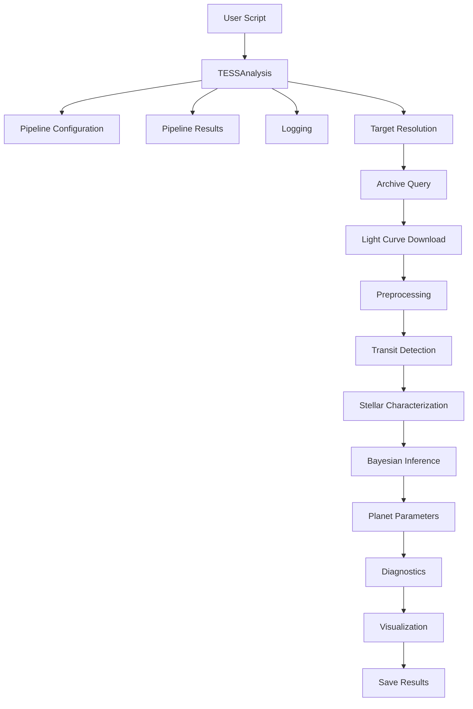
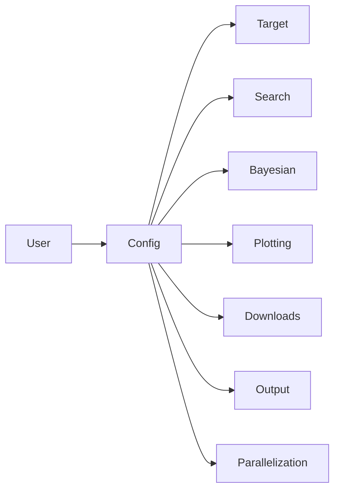

# Chapter 2
# Current Software Architecture

---

# 2.1 Overview

The TESS Exoplanet Detection and Bayesian Characterization Pipeline is designed as a **modular, stage-based scientific workflow**. Rather than implementing one large procedural script, the pipeline decomposes the complete exoplanet analysis into a sequence of independent processing stages.

Each stage performs a single scientific task and communicates with subsequent stages through a shared `PipelineResults` object.

The architecture follows the principles of

- modularity,
- separation of concerns,
- reproducibility,
- extensibility, and
- computational efficiency.

The resulting design allows new algorithms to be integrated with minimal changes to the remainder of the pipeline.

---

# 2.2 Overall Architecture

The highest level of the pipeline can be represented as



The entire pipeline is coordinated by the `TESSAnalysis` class.

No individual scientific module communicates directly with another module.

Instead, every stage exchanges information exclusively through the shared results container.

---

# 2.3 Main Components

The current implementation consists of four major architectural layers.

```text
──────────────────────────────────────────────

User Layer

──────────────────────────────────────────────

        TESSAnalysis

──────────────────────────────────────────────

Scientific Processing Stages

──────────────────────────────────────────────

Utility Modules

──────────────────────────────────────────────

External Scientific Libraries

──────────────────────────────────────────────
```

Each layer has a distinct responsibility.

---

# 2.4 User Layer

The user interacts exclusively with

```python
analysis = TESSAnalysis(...)
```

Typical workflow

```python
analysis.resolve_target()

analysis.lookup_archive_period()

analysis.load_lightcurves()

analysis.preprocess()

analysis.search_period()

analysis.query_gaia()

analysis.characterize_star()

analysis.fit_transit()

analysis.derive_planet_parameters()

analysis.check_convergence()

analysis.generate_figures()

analysis.save()
```

The user never directly calls

- TLS
- BLS
- GP
- Gaia
- MAST
- PyMC

Those details remain encapsulated.

---

# 2.5 Configuration Layer

All pipeline behaviour is controlled through a single configuration object.



Typical configuration parameters include

| Category | Examples |
|------------|-------------------------------|
| Target | TIC ID, coordinates |
| Search | TLS/BLS, period limits |
| Detection | max planets |
| Bayesian | chains, draws, tune |
| GP | kernel type |
| Downloads | sectors |
| Output | directory, plots |
| Overrides | archive period |

The configuration object is read-only during most of the pipeline.

The only notable exception is

```python
max_planets
```

which may be increased dynamically when the archive reports more planets than requested.

---

# 2.6 PipelineResults

The most important object in the software architecture is

```python
PipelineResults
```

Every stage stores its output here.

No stage returns large scientific products directly.

Instead,

```text
Stage

↓

PipelineResults

↓

Next Stage
```

The results object gradually accumulates information throughout execution.

---

## Example lifecycle

Immediately after initialization

```text
PipelineResults

target

metadata
```

After archive lookup

```text
PipelineResults

target

archive periods

reference

metadata
```

After downloading

```text
PipelineResults

LightCurveCollection
```

After preprocessing

```text
PipelineResults

stitched light curve

cleaned light curve
```

After detection

```text
PipelineResults

detections

period

epoch

depth

duration
```

After Bayesian inference

```text
PipelineResults

posterior

trace

model

GP

planet samples
```

After parameter derivation

```text
PipelineResults

planet radius

planet mass

semi-major axis

equilibrium temperature

etc.
```

---

# 2.7 Processing Stages

The current implementation contains the following processing stages.

```mermaid
flowchart TD

Target

↓

Archive

↓

Download

↓

Preprocess

↓

Detection

↓

Gaia

↓

Stellar

↓

Inference

↓

Planet Parameters

↓

Diagnostics
```

Each stage performs a single scientific task.

This greatly simplifies testing.

---

# 2.8 Internal Data Flow

The movement of information through the pipeline is illustrated below.


Only derived products move between stages.

Intermediate implementation details remain hidden.

---

# 2.9 Class Dependencies

The principal classes are

```text
TESSAnalysis

│

├── TargetStage

├── DownloadStage

├── PreprocessingStage

├── PeriodStage

├── StellarStage

├── InferenceStage

├── VisualizationStage

└── SaveStage
```

Each stage owns only the algorithms required for its scientific purpose.

This minimizes coupling.

---

# 2.10 External Dependencies

The pipeline makes extensive use of modern astronomical software.

```mermaid
flowchart LR

Pipeline

--> Lightkurve

Pipeline

--> Astroquery

Pipeline

--> Astropy

Pipeline

--> NumPy

Pipeline

--> SciPy

Pipeline

--> TransitLeastSquares

Pipeline

--> PyMC

Pipeline

--> exoplanet

Pipeline

--> celerite2

Pipeline

--> Batman

Pipeline

--> Gaia Archive
```

Each dependency performs a specialized task.

---

# 2.11 Stage Execution Order

The complete execution order is

```mermaid
flowchart TD

Start

-->

Resolve Target

-->

Archive Lookup

-->

Download TESS

-->

Preprocessing

-->

TLS/BLS

-->

Gaia

-->

Host Star

-->

Bayesian

-->

Planet Parameters

-->

Diagnostics

-->

Figures

-->

Save

-->

Finish
```

This represents the production workflow.

---

# 2.12 Decision Points

The pipeline contains several important decision nodes.

## Archive period available?

```text
Archive Period?

Yes

↓

Refine Period

No

↓

Run Full TLS
```

---

## Multiple planets?

```text
Multiple Detections?

Yes

↓

Mask Previous Transit

↓

Search Residuals

No

↓

Continue
```

---

## Bayesian inference enabled?

```text
Inference?

Yes

↓

Run MCMC

No

↓

Quick Batman Model
```

---

## Multiple planet Bayesian fit?

```text
Second Candidate

↓

Probability Threshold

↓

Fit 2 Planets?

Otherwise

↓

Fit 1 Planet
```

---

# 2.13 Object Lifetime

Objects evolve throughout execution.

```mermaid
flowchart LR

Configuration

-->

Target

-->

LightCurveCollection

-->

LightCurve

-->

Detections

-->

Posterior

-->

Planet Parameters

-->

Final Report
```

Every object remains available inside `PipelineResults`.

This greatly improves reproducibility.

---

# 2.14 Architectural Strengths

The current implementation exhibits several notable strengths.

## Modular Design

Scientific algorithms are isolated.

Replacing one algorithm rarely affects others.

---

## Excellent Separation of Responsibilities

Each stage performs one task.

Examples

- preprocessing

- detection

- inference

- visualization

This makes maintenance straightforward.

---

## Shared Results Object

Using a single results container avoids complicated parameter passing.

The design resembles a scientific data pipeline.

---

## Extensibility

Adding support for

- PLATO

- CHEOPS

- radial velocities

- eclipse fitting

- additional transit search algorithms

would require only local modifications.

---

## Reproducibility

Intermediate products remain accessible.

A failed pipeline execution can usually be resumed without repeating earlier computations.

---

# 2.15 Current Architectural Limitations

Although the architecture is strong, several limitations are evident.

## Sequential Execution

Most stages execute serially.

Large-scale surveys could benefit from parallel execution.

---

## Mutable Shared State

Every stage modifies `PipelineResults`.

Although convenient, mutable shared state can make debugging more difficult if later stages inadvertently overwrite earlier results.

---

## Stage Dependencies

Some scientific dependencies remain implicit.

For example,

the Bayesian stage assumes

- preprocessing completed successfully

- detections exist

- stellar parameters are available

These assumptions are not fully enforced through the type system.

---

## Limited Caching

Archive queries,

Gaia queries,

and downloaded light curves

could all benefit from a more systematic caching mechanism.

---

## Runtime Scheduling

Current execution order is fixed.

Future versions could employ a directed acyclic graph (DAG) scheduler, allowing independent stages to execute concurrently.

---

# 2.16 Summary

The current software architecture is clean, modular, and scientifically well organized.

Its strongest design features are

- clear separation of scientific stages,
- centralized configuration,
- shared results container,
- modular inference framework,
- extensibility.

The architecture already resembles that of mature astronomical software packages.

Most remaining improvements concern computational efficiency, stronger type safety, better dependency management, and increased parallelism rather than fundamental redesign.

The following chapters examine each processing stage in detail, beginning with **Target Resolution**.